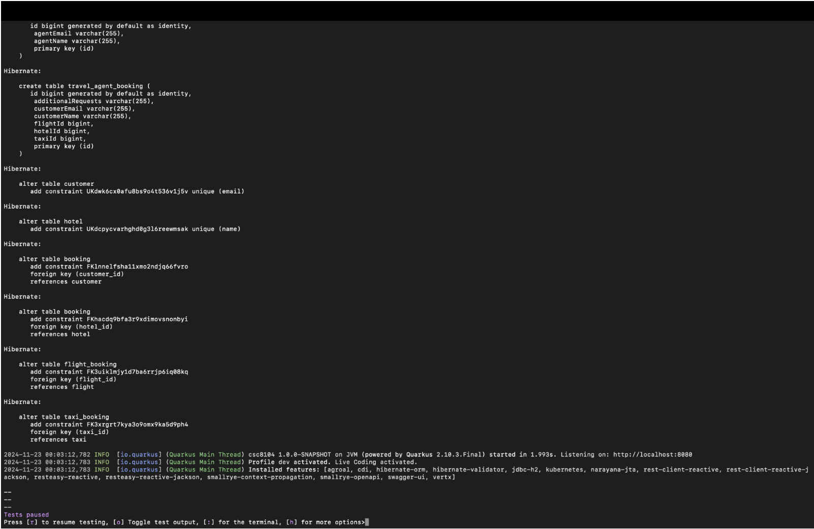
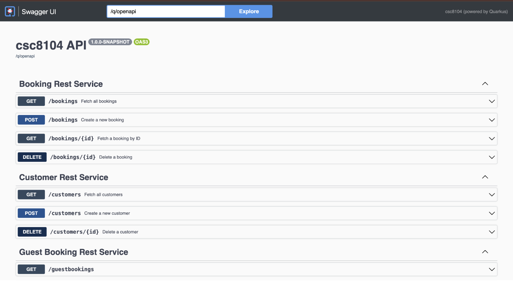
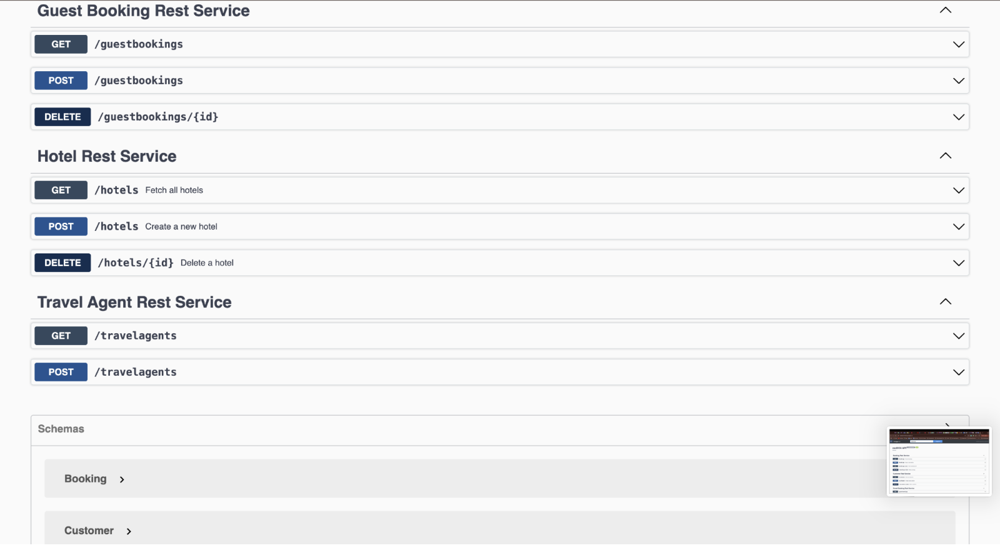

# 🏨 Hotel Booking API – Quarkus + OpenShift

This is my final coursework project for the CSC8104: Enterprise Middleware module at Newcastle University.

It implements a **RESTful API** for managing **hotel bookings** as part of a larger travel agency system. The backend is built using **Quarkus**, integrated with JPA, JTA, and is cloud-deployed using **OpenShift**.

---

## 📌 Features

- Create, read, update, delete hotel records
- Book and cancel hotel reservations
- Ensure unique hotel names and booking constraints
- Validate guest input with JSR 380 (`@NotNull`, `@Pattern`)
- Custom exception handling
- OpenAPI Swagger integration
- CI/CD ready with Maven + S2I deployment to OpenShift

---

## 🚀 Tech Stack

| Layer        | Tech Stack                      |
|--------------|----------------------------------|
| Language     | Java 17                          |
| Framework    | Quarkus (JAX-RS, JPA, JTA)       |
| Deployment   | OpenShift 4 (Source-to-Image)    |
| API Docs     | Swagger / OpenAPI                |
| Testing      | REST Assured                     |
| Build Tool   | Maven                            |

---

## 🗂️ Project Structure

src/main/java/uk/ac/newcastle/enterprisemiddleware/
│
├── hotel/             # Hotel entity & logic
├── booking/           # Booking service and validations
├── travelagent/       # Integration layer
├── guestbooking/      # JTA-based guest booking API
├── util/              # Validators and exception handlers
└── Application.java   # Main Quarkus application

resources/
├── application.properties
├── import.sql

---

---

## 🧪 How to Run Locally

bash
./mvnw compile quarkus:dev

Visit Swagger UI at:
http://localhost:8080/q/swagger-ui

---
## ☁️ Deployment

- Pushed to OpenShift using GitHub S2I pipeline  
- Scalable cloud-native microservice  
- Each student’s REST API (hotel/flight/taxi) is integrated in the shared TravelAgent service

---

## 📸 Screenshots

See `/docs/` for OpenShift dashboard and Swagger UI captures.

### 🔹 Hibernate Console: Auto-Generated DB Schema

### 🔹 Swagger UI – Part 1: Booking & Customer APIs

### 🔹 Swagger UI – Part 2: Guest Booking, Hotel, TravelAgent

---

## 📄 License

This project is open-source under the **MIT License**.

---

## 👨‍💻 Author

**Samuel Sathiyamoorthy**  
MSc Cloud Computing – Newcastle University  
📫 ssamuelpillai@gmail.com
